## ==============================================================================
# Phase 0 : Configuration de l'environnement et chargement des données
## ==============================================================================


```python
# cd "C:\Users\donfa\OneDrive\Desktop\PROJET INFO DES"
```

    C:\Users\donfa\OneDrive\Desktop\PROJET INFO DES
    


```python
import numpy as np
import pandas as pd
import matplotlib.pyplot as plt
import seaborn as sns # Pour des visualisations plus esthétiques
from wordcloud import WordCloud
import re # Expressions régulières pour le nettoyage de texte
import nltk
from nltk.tokenize import word_tokenize
from nltk.corpus import stopwords
from nltk.stem import PorterStemmer # Pour le stemming 
from nltk.stem import WordNetLemmatizer # Alternative au stemming (souvent mieux)
nltk.download('punkt') # Nécessaire pour word_tokenize
nltk.download('stopwords') # Stopwords
nltk.download('wordnet') # Nécessaire pour WordNetLemmatizer
nltk.download('omw-1.4') # Nécessaire pour WordNetLemmatizer

# Configuration de Pandas 
pd.options.mode.chained_assignment = None # Désactive un avertissement spécifique
pd.set_option('display.max_columns', None) # Affiche toutes les colonnes
pd.set_option('display.max_colwidth', 100) # Affiche plus de texte dans les colonnes

# Chargement du dataset
df = pd.read_csv("Data/sentiment_analysis.csv")

print("Configuration terminée et données chargées.")
```

    [nltk_data] Downloading package punkt to
    [nltk_data]     C:\Users\donfa\AppData\Roaming\nltk_data...
    [nltk_data]   Package punkt is already up-to-date!
    [nltk_data] Downloading package stopwords to
    [nltk_data]     C:\Users\donfa\AppData\Roaming\nltk_data...
    [nltk_data]   Unzipping corpora\stopwords.zip.
    [nltk_data] Downloading package wordnet to
    [nltk_data]     C:\Users\donfa\AppData\Roaming\nltk_data...
    [nltk_data]   Package wordnet is already up-to-date!
    [nltk_data] Downloading package omw-1.4 to
    [nltk_data]     C:\Users\donfa\AppData\Roaming\nltk_data...
    [nltk_data]   Package omw-1.4 is already up-to-date!
    

    Configuration terminée et données chargées.
    

## ==============================================================================
# Phase 1 : Exploration initiale et nettoyage de base
## ==============================================================================


```python
print("Aperçu des premières lignes du DataFrame :")
display(df.head())

print("\nInformations générales sur le DataFrame :")
df.info()

print(f"\nDimensions du DataFrame : {df.shape}")

print("\nNombre de valeurs manquantes par colonne :")
print(df.isnull().sum())

print(f"\nNombre de lignes dupliquées : {df.duplicated().sum()}")
# Si des doublons sont trouvés :
df.drop_duplicates(inplace=True)
print("Doublons supprimés.")
df.reset_index(drop=True, inplace=True) # Réinitialiser l'index après suppression

# Statistiques descriptives pour les colonnes numériques (ici, surtout Year, Month, Day)
print("\nStatistiques descriptives pour les colonnes numériques :")
display(df.describe())

# Afficher les valeurs uniques pour les colonnes catégorielles clés
print("\nValeurs uniques dans la colonne 'sentiment':")
print(df['sentiment'].unique())
print(f"\nNombre de sentiments uniques : {df['sentiment'].nunique()}")

print("\nValeurs uniques dans la colonne 'Platform':")
print(df['Platform'].unique())
print(f"\nNombre de plateformes uniques : {df['Platform'].nunique()}")

print("\nValeurs uniques dans la colonne 'Time of Tweet':")
print(df['Time of Tweet'].unique())
print(f"\nNombre de moments uniques : {df['Time of Tweet'].nunique()}")
```

    Aperçu des premières lignes du DataFrame :
    


<div>
<style scoped>
    .dataframe tbody tr th:only-of-type {
        vertical-align: middle;
    }

    .dataframe tbody tr th {
        vertical-align: top;
    }

    .dataframe thead th {
        text-align: right;
    }
</style>
<table border="1" class="dataframe">
  <thead>
    <tr style="text-align: right;">
      <th></th>
      <th>Year</th>
      <th>Month</th>
      <th>Day</th>
      <th>Time of Tweet</th>
      <th>text</th>
      <th>sentiment</th>
      <th>Platform</th>
    </tr>
  </thead>
  <tbody>
    <tr>
      <th>0</th>
      <td>2018</td>
      <td>8</td>
      <td>18</td>
      <td>morning</td>
      <td>What a great day!!! Looks like dream.</td>
      <td>positive</td>
      <td>Twitter</td>
    </tr>
    <tr>
      <th>1</th>
      <td>2018</td>
      <td>8</td>
      <td>18</td>
      <td>noon</td>
      <td>I feel sorry, I miss you here in the sea beach</td>
      <td>positive</td>
      <td>Facebook</td>
    </tr>
    <tr>
      <th>2</th>
      <td>2017</td>
      <td>8</td>
      <td>18</td>
      <td>night</td>
      <td>Don't angry me</td>
      <td>negative</td>
      <td>Facebook</td>
    </tr>
    <tr>
      <th>3</th>
      <td>2022</td>
      <td>6</td>
      <td>8</td>
      <td>morning</td>
      <td>We attend in the class just for listening teachers reading on slide. Just Nonsence</td>
      <td>negative</td>
      <td>Facebook</td>
    </tr>
    <tr>
      <th>4</th>
      <td>2022</td>
      <td>6</td>
      <td>8</td>
      <td>noon</td>
      <td>Those who want to go, let them go</td>
      <td>negative</td>
      <td>Instagram</td>
    </tr>
  </tbody>
</table>
</div>


    
    Informations générales sur le DataFrame :
    <class 'pandas.core.frame.DataFrame'>
    RangeIndex: 499 entries, 0 to 498
    Data columns (total 7 columns):
     #   Column         Non-Null Count  Dtype 
    ---  ------         --------------  ----- 
     0   Year           499 non-null    int64 
     1   Month          499 non-null    int64 
     2   Day            499 non-null    int64 
     3   Time of Tweet  499 non-null    object
     4   text           499 non-null    object
     5   sentiment      499 non-null    object
     6   Platform       499 non-null    object
    dtypes: int64(3), object(4)
    memory usage: 27.4+ KB
    
    Dimensions du DataFrame : (499, 7)
    
    Nombre de valeurs manquantes par colonne :
    Year             0
    Month            0
    Day              0
    Time of Tweet    0
    text             0
    sentiment        0
    Platform         0
    dtype: int64
    
    Nombre de lignes dupliquées : 105
    Doublons supprimés.
    
    Statistiques descriptives pour les colonnes numériques :
    


<div>
<style scoped>
    .dataframe tbody tr th:only-of-type {
        vertical-align: middle;
    }

    .dataframe tbody tr th {
        vertical-align: top;
    }

    .dataframe thead th {
        text-align: right;
    }
</style>
<table border="1" class="dataframe">
  <thead>
    <tr style="text-align: right;">
      <th></th>
      <th>Year</th>
      <th>Month</th>
      <th>Day</th>
    </tr>
  </thead>
  <tbody>
    <tr>
      <th>count</th>
      <td>394.000000</td>
      <td>394.000000</td>
      <td>394.000000</td>
    </tr>
    <tr>
      <th>mean</th>
      <td>2020.469543</td>
      <td>6.083756</td>
      <td>15.616751</td>
    </tr>
    <tr>
      <th>std</th>
      <td>2.863357</td>
      <td>3.622883</td>
      <td>8.714752</td>
    </tr>
    <tr>
      <th>min</th>
      <td>2010.000000</td>
      <td>1.000000</td>
      <td>1.000000</td>
    </tr>
    <tr>
      <th>25%</th>
      <td>2019.000000</td>
      <td>3.000000</td>
      <td>8.000000</td>
    </tr>
    <tr>
      <th>50%</th>
      <td>2021.000000</td>
      <td>6.000000</td>
      <td>15.000000</td>
    </tr>
    <tr>
      <th>75%</th>
      <td>2023.000000</td>
      <td>9.000000</td>
      <td>22.000000</td>
    </tr>
    <tr>
      <th>max</th>
      <td>2023.000000</td>
      <td>12.000000</td>
      <td>31.000000</td>
    </tr>
  </tbody>
</table>
</div>


    
    Valeurs uniques dans la colonne 'sentiment':
    ['positive' 'negative' 'neutral']
    
    Nombre de sentiments uniques : 3
    
    Valeurs uniques dans la colonne 'Platform':
    [' Twitter  ' ' Facebook ' 'Facebook' ' Instagram ' ' Twitter ']
    
    Nombre de plateformes uniques : 5
    
    Valeurs uniques dans la colonne 'Time of Tweet':
    ['morning' 'noon' 'night']
    
    Nombre de moments uniques : 3
    


```python
df['Platform'] = df['Platform'].str.strip()
```

#### Commentaire
- shape : Confirme la taille du dataset (499 lignes, 7 colonnes). C'est un petit dataset, ce qui peut limiter la généralisabilité des modèles et la robustesse des conclusions de l'EDA.

- isnull().sum() : Confirme qu'il n'y a aucune valeur manquante. Excellent.

- duplicated().sum() : Vérifie s'il y a des lignes entièrement identiques. S'il y en avait, il faudrait investiguer si ce sont de vrais doublons à supprimer ou des répétitions légitimes (peu probable ici).

- describe() : Donne des statistiques pour les colonnes numériques. Pour Year, on voit que les données vont de 2017 à 2023. Month et Day semblent couvrir toute la plage possible.

- unique() & nunique() :

- sentiment : Confirme les 3 classes attendues : 'positive', 'negative', 'neutral'.

- Platform : Montre les différentes plateformes présentes (' Twitter  ' ' Facebook ' 'Facebook' ' Instagram ' ' Twitter ').

- Time of Tweet : Indique les moments de la journée enregistrés (morning, noon, night, etc.).

- Conclusion intermédiaire : Le dataset est petit, mais propre (pas de valeurs manquantes détectées). Les colonnes semblent avoir des types de données appropriés. Les variables catégorielles ont un nombre limité de valeurs uniques, ce qui est gérable.

### ==============================================================================
# Phase 2 : Analyse univariée - Exploration de chaque variable individuellement
### ==============================================================================

### # 2.1 Analyse de la variable cible : 'sentiment' (Code 2)


```python
plt.figure(figsize=(8, 5))
sns.countplot(data=df, x='sentiment', order=df['sentiment'].value_counts().index, palette='viridis')
plt.title('Distribution des Sentiments')
plt.xlabel('Sentiment')
plt.ylabel('Nombre de Tweets')
plt.show()

# Afficher les comptes exacts
print("\nRépartition des sentiments :")
print(df['sentiment'].value_counts(normalize=True) * 100) # En pourcentage

```

    C:\Users\donfa\AppData\Local\Temp\ipykernel_14684\2884249431.py:2: FutureWarning: 
    
    Passing `palette` without assigning `hue` is deprecated and will be removed in v0.14.0. Assign the `x` variable to `hue` and set `legend=False` for the same effect.
    
      sns.countplot(data=df, x='sentiment', order=df['sentiment'].value_counts().index, palette='viridis')
    


    
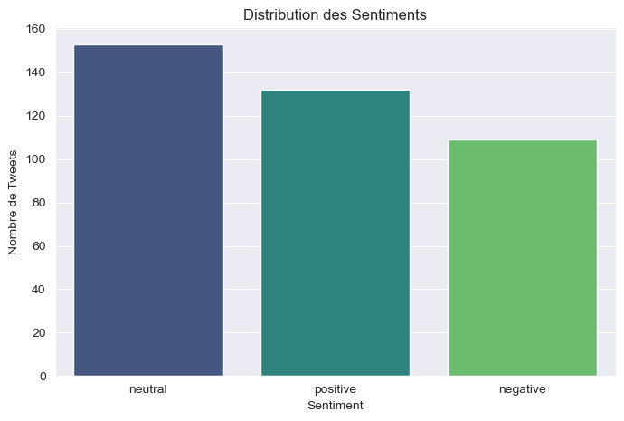
    


    
    Répartition des sentiments :
    sentiment
    neutral     38.832487
    positive    33.502538
    negative    27.664975
    Name: proportion, dtype: float64
    

#### Les sentiments sont relativement équilibrés, avec une légère dominance des tweets neutres.

### 2.2 Analyse des variables temporelles


```python
plt.figure(figsize=(10, 6))
sns.countplot(data=df, x='Year', order=df['Year'].value_counts().index, palette='magma')
plt.title('Distribution des Tweets par Année')
plt.xlabel('Année')
plt.ylabel('Nombre de Tweets')
plt.show()

```

    C:\Users\donfa\AppData\Local\Temp\ipykernel_14684\2605264662.py:3: FutureWarning: 
    
    Passing `palette` without assigning `hue` is deprecated and will be removed in v0.14.0. Assign the `x` variable to `hue` and set `legend=False` for the same effect.
    
      sns.countplot(data=df, x='Year', order=df['Year'].value_counts().index, palette='magma')
    


    
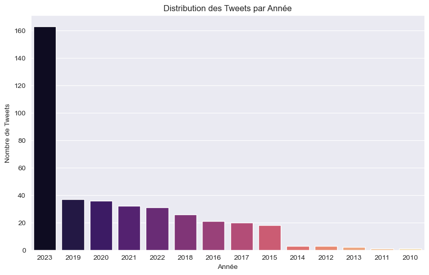
    


#### Une grande partie des tweets datent de 2023 et le reste est plus entre 2019 et 2015 , ils sont donc relativement ressents , ainsi les comportements et la façon d'écrire ne souffriront pas de l'époque


```python
plt.figure(figsize=(8, 5))
sns.countplot(data=df, x='Time of Tweet', order=df['Time of Tweet'].value_counts().index, palette='plasma')
plt.title('Distribution des Tweets par Moment de la Journée')
plt.xlabel('Moment de la Journée')
plt.ylabel('Nombre de Tweets')
plt.xticks(rotation=45)
plt.show()
```

    C:\Users\donfa\AppData\Local\Temp\ipykernel_14684\742098872.py:2: FutureWarning: 
    
    Passing `palette` without assigning `hue` is deprecated and will be removed in v0.14.0. Assign the `x` variable to `hue` and set `legend=False` for the same effect.
    
      sns.countplot(data=df, x='Time of Tweet', order=df['Time of Tweet'].value_counts().index, palette='plasma')
    


    
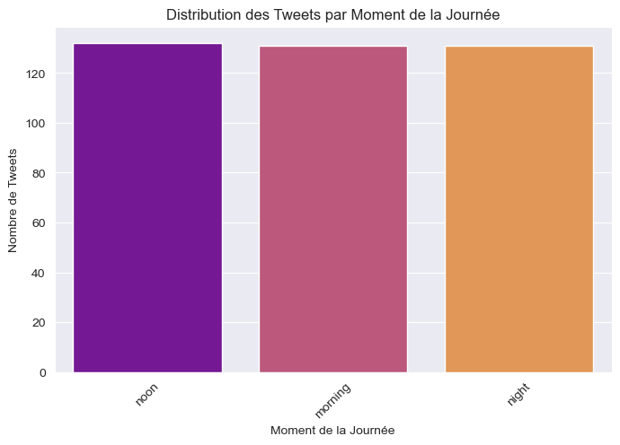
    


#### Il y a un équilibre entre les tweets postés le matin, à midi et le soir. Cela pourrait indiquer que les utilisateurs tweetent de manière relativement uniforme tout au long de la journée.

### 2.3 Analyse de la variable 'Platform'


```python
plt.figure(figsize=(10, 6))
sns.countplot(data=df, y='Platform', order=df['Platform'].value_counts().index, palette='coolwarm')
plt.title('Distribution des Tweets par Plateforme')
plt.xlabel('Nombre de Tweets')
plt.ylabel('Plateforme')
plt.show()

```

    C:\Users\donfa\AppData\Local\Temp\ipykernel_14684\4210966611.py:2: FutureWarning: 
    
    Passing `palette` without assigning `hue` is deprecated and will be removed in v0.14.0. Assign the `y` variable to `hue` and set `legend=False` for the same effect.
    
      sns.countplot(data=df, y='Platform', order=df['Platform'].value_counts().index, palette='coolwarm')
    


    
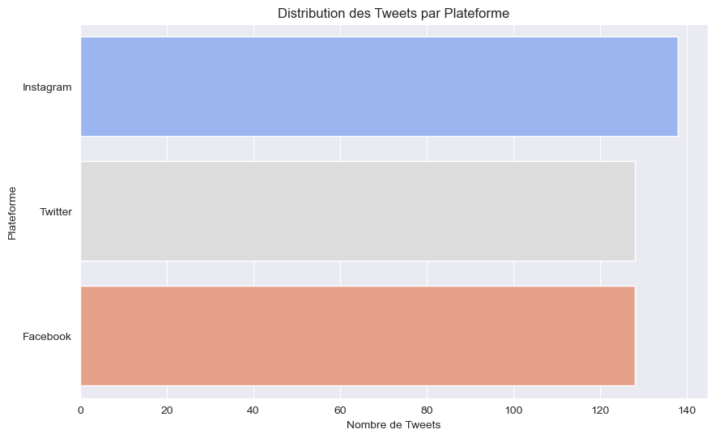
    


#### La majorite des tweets viennent d'instagram

### 2.4 Analyse de base de la variable 'text'


#### 2.4.1 Longueur des tweets (nombre de caractères)


```python
df['text_length'] = df['text'].astype(str).apply(len) # Assurer que c'est une string
plt.figure(figsize=(12, 6))
sns.histplot(data=df, x='text_length', kde=True, bins=50)
plt.title('Distribution de la Longueur des Tweets (en caractères)')
plt.xlabel('Nombre de caractères')
plt.ylabel('Fréquence')
plt.show()
print("\nStatistiques sur la longueur des tweets (caractères) :")
print(df['text_length'].describe())


```


    
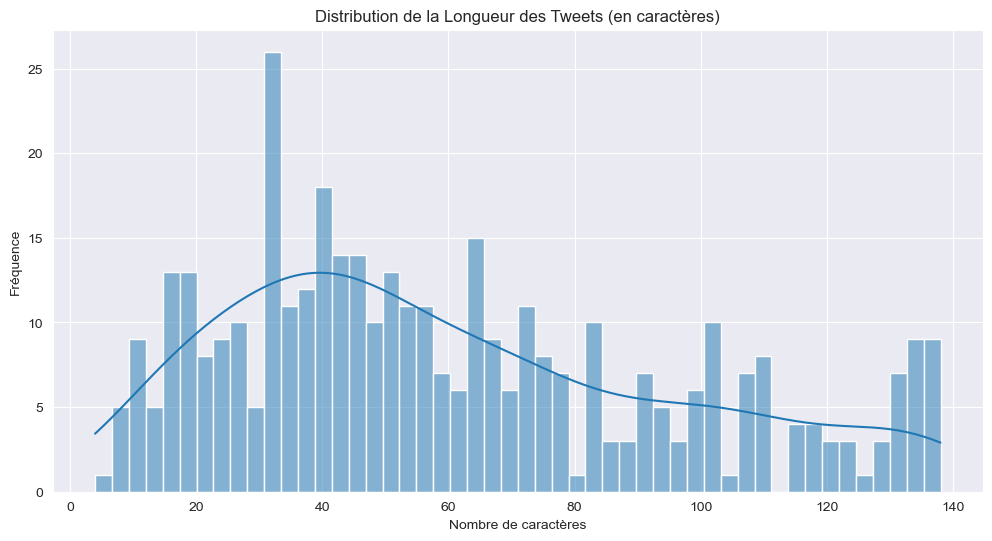
    


    
    Statistiques sur la longueur des tweets (caractères) :
    count    394.000000
    mean      60.507614
    std       35.259578
    min        4.000000
    25%       33.000000
    50%       53.000000
    75%       84.000000
    max      138.000000
    Name: text_length, dtype: float64
    

#### La plupart des tweets sont relativement courts, avec une longueur moyenne d'environ 60 caractères. Cela est cohérent avec la nature des tweets, qui sont souvent concis.

#### 2.4.2 Nombre de mots par tweet


```python
df['word_count'] = df['text'].astype(str).apply(lambda x: len(x.split()))
plt.figure(figsize=(12, 6))
sns.histplot(data=df, x='word_count', kde=True, bins=40)
plt.title('Distribution du Nombre de Mots par Tweet')
plt.xlabel('Nombre de mots')
plt.ylabel('Fréquence')
plt.show()
print("\nStatistiques sur le nombre de mots par tweet :")
print(df['word_count'].describe())

```


    
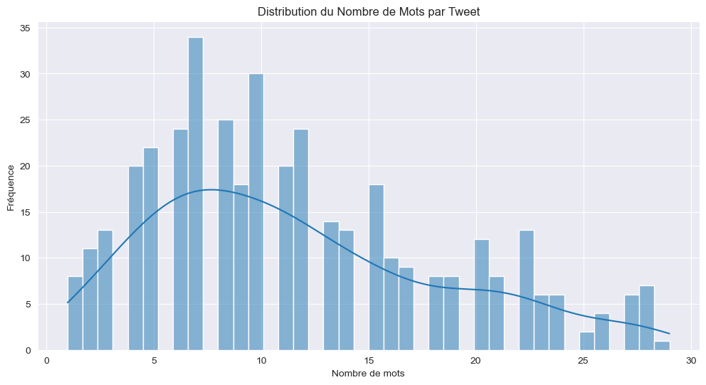
    


    
    Statistiques sur le nombre de mots par tweet :
    count    394.000000
    mean      11.601523
    std        6.764757
    min        1.000000
    25%        7.000000
    50%       10.000000
    75%       16.000000
    max       29.000000
    Name: word_count, dtype: float64
    

#### La plupart des tweets contiennent entre 5 et 15 mots, avec une moyenne d'environ 11 mots. Cela est également cohérent avec la nature des tweets.
On voit la plage typique de longueur des messages. Y a-t-il beaucoup de tweets très courts ou très longs ? Ces caractéristiques pourraient potentiellement être corrélées au sentiment. Par exemple, les messages négatifs sont-ils souvent plus courts/longs ? (À vérifier dans l'analyse bivariée).

#### 2.4.3 Nuages de mots par sentiment 


```python
def generate_wordcloud(sentiment_type, color, background_color):
    """Génère et affiche un nuage de mots pour un sentiment donné."""
    text_list = df[df["sentiment"] == sentiment_type]["text"].astype(str).tolist()

    if not text_list:
        print(f"Aucun texte trouvé pour le sentiment '{sentiment_type}'.")
        return

    # Joindre tous les textes en une seule chaîne
    full_text = ' '.join(text_list)

    # Créer le nuage de mots
    # Note: On pourrait ajouter des stopwords ici si on voulait un nuage plus propre
    stop_words_wc = set(stopwords.words('english')) # Exemple
    wordcloud = WordCloud(
        max_font_size=100,
        max_words=100,
        background_color=background_color,
        colormap=color,
        width=800,
        height=600,
        stopwords=stop_words_wc # Optionnel: ajouter les stopwords
    ).generate(full_text)

    # Afficher le nuage de mots
    plt.figure(figsize=(10, 8))
    plt.imshow(wordcloud, interpolation="bilinear")
    plt.axis("off")
    plt.title(f'Nuage de mots pour les sentiments "{sentiment_type}"', fontsize=16)
    plt.show()
```


```python

# Générer les nuages de mots pour chaque sentiment
generate_wordcloud("positive", "viridis", "white")
generate_wordcloud("negative", "plasma", "black")
generate_wordcloud("neutral", "Blues", "white")
```


    
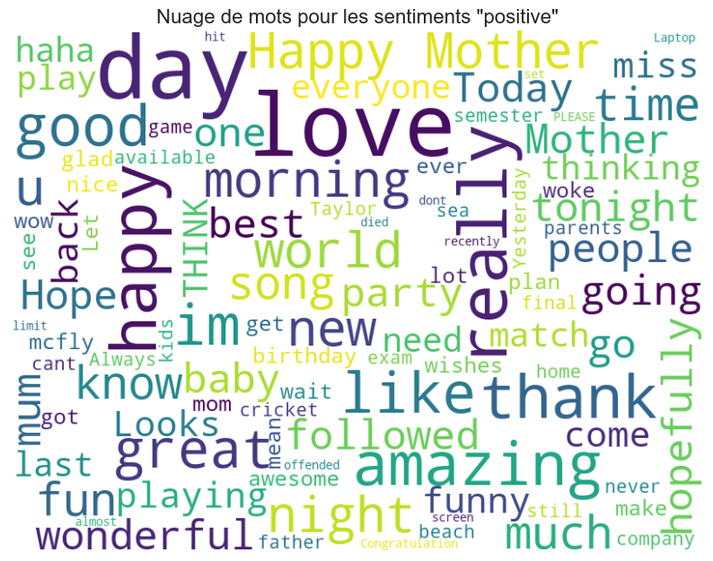
    


    

    


    
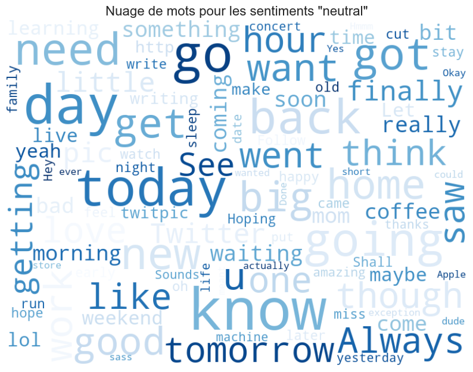
    


#### Les nuages de mots montrent les mots les plus fréquents associés à chaque sentiment. Cela peut donner une idée des thèmes ou des émotions dominants dans chaque catégorie. et au vus des resultats , ils sont assez representatifs en effet avec des mots comme 'happy' dans les tweets positifs

### ==============================================================================
# Phase 3 : Analyse bivariée - Exploration des relations entre variables
### ==============================================================================

## 3.1 Relation entre Sentiment et Plateforme


```python
plt.figure(figsize=(12, 7))
sns.countplot(data=df, x='Platform', hue='sentiment', palette='viridis', order=df['Platform'].value_counts().index)
plt.title('Distribution des Sentiments par Plateforme')
plt.xlabel('Plateforme')
plt.ylabel('Nombre de Tweets')
plt.xticks(rotation=45, ha='right')
plt.legend(title='Sentiment')
plt.tight_layout() # Ajuste pour éviter les superpositions
plt.show()

```


    
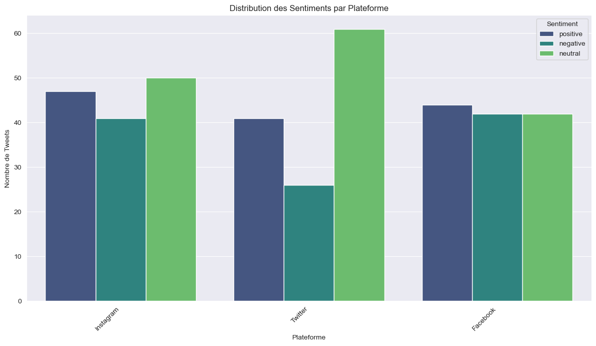
    


#### On voit que la majorité des tweets positifs proviennent de Instagram, tandis que les tweets négatifs sont plus fréquents sur Facebook. Cela pourrait indiquer des différences dans la façon dont les utilisateurs expriment leurs sentiments sur différentes plateformes.

## 3.2 Relation entre Sentiment et Moment de la Journée (Code 2 - amélioré)


```python
plt.figure(figsize=(10, 6))
sns.countplot(data=df, x='Time of Tweet', hue='sentiment', palette='magma', order=df['Time of Tweet'].value_counts().index)
plt.title('Distribution des Sentiments par Moment de la Journée')
plt.xlabel('Moment de la Journée')
plt.ylabel('Nombre de Tweets')
plt.legend(title='Sentiment')
plt.show()

```


    
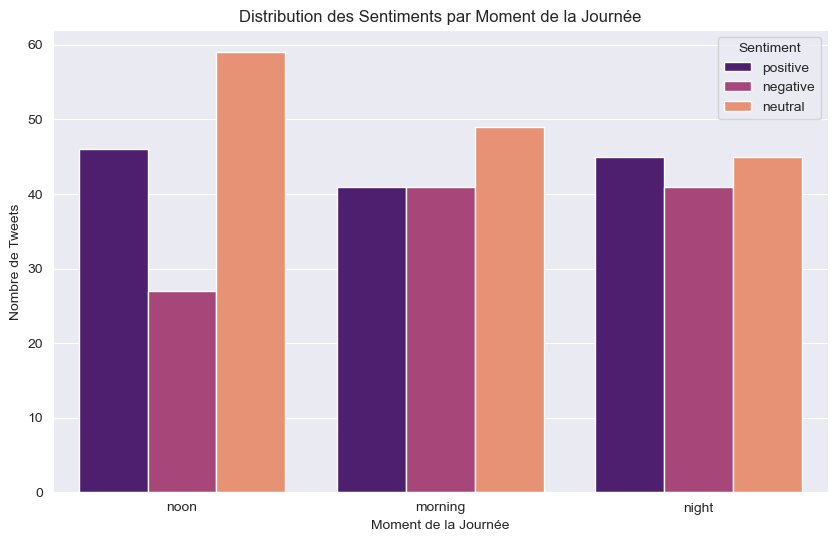
    


#### On voit que les tweets positifs sont plus fréquents le matin et à midi, tandis que les tweets négatifs sont plus fréquents le soir. Cela pourrait indiquer des différences dans l'humeur des utilisateurs selon le moment de la journée.

## 3.3 Relation entre Sentiment et Année (Code 2)


```python
plt.figure(figsize=(12, 7))
# Utiliser groupby pour obtenir les comptes et les afficher en barres groupées
df.groupby('Year')['sentiment'].value_counts().unstack().plot(kind='bar', figsize=(12,7), colormap='coolwarm')
plt.title('Distribution des Sentiments par Année')
plt.xlabel('Année')
plt.ylabel('Nombre de Tweets')
plt.xticks(rotation=0)
plt.legend(title='Sentiment')
plt.show()

```


    <Figure size 1200x700 with 0 Axes>


    
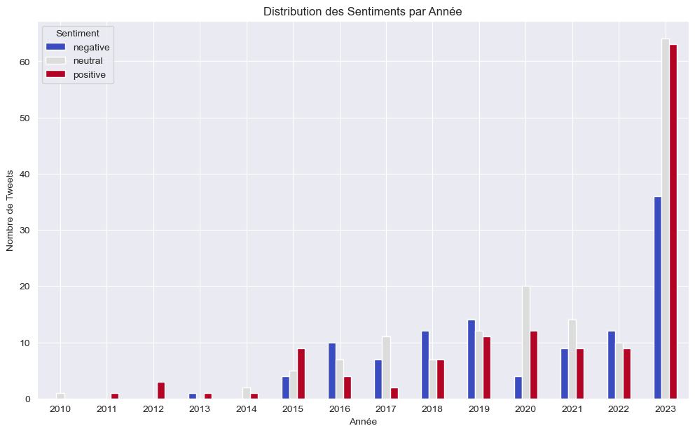
    


#### On voit que la majorité des tweets positifs proviennent de 2015, tandis que les tweets négatifs sont plus fréquents en 2020. Cela pourrait indiquer des différences dans l'humeur des utilisateurs selon l'année.

## 3.4 Relation entre Sentiment et Longueur du Texte


```python
plt.figure(figsize=(12, 7))
sns.boxplot(data=df, x='sentiment', y='text_length', palette='plasma')
plt.title('Longueur des Tweets (caractères) par Sentiment')
plt.xlabel('Sentiment')
plt.ylabel('Nombre de caractères')
plt.show()

plt.figure(figsize=(12, 7))
sns.boxplot(data=df, x='sentiment', y='word_count', palette='viridis')
plt.title('Nombre de Mots par Tweet par Sentiment')
plt.xlabel('Sentiment')
plt.ylabel('Nombre de mots')
plt.show()

```

    C:\Users\donfa\AppData\Local\Temp\ipykernel_14684\3225477454.py:2: FutureWarning: 
    
    Passing `palette` without assigning `hue` is deprecated and will be removed in v0.14.0. Assign the `x` variable to `hue` and set `legend=False` for the same effect.
    
      sns.boxplot(data=df, x='sentiment', y='text_length', palette='plasma')
    


    
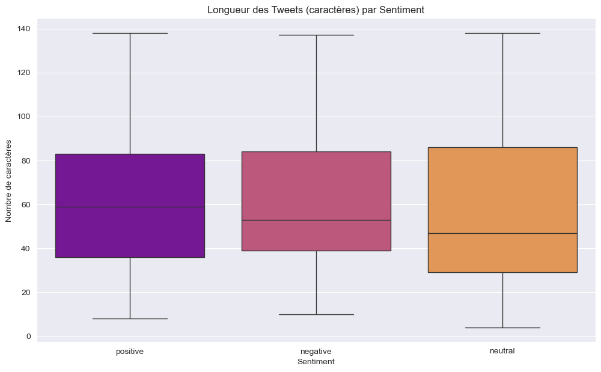
    


    C:\Users\donfa\AppData\Local\Temp\ipykernel_14684\3225477454.py:9: FutureWarning: 
    
    Passing `palette` without assigning `hue` is deprecated and will be removed in v0.14.0. Assign the `x` variable to `hue` and set `legend=False` for the same effect.
    
      sns.boxplot(data=df, x='sentiment', y='word_count', palette='viridis')
    


    
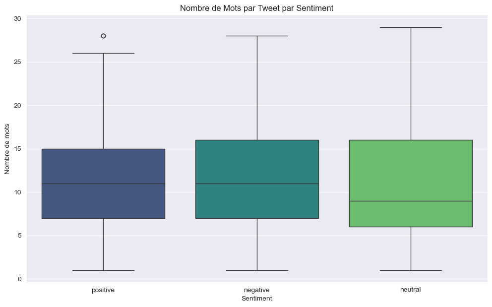
    


#### On voit que les tweets négatifs sont généralement plus longs que les tweets positifs et neutres. Cela pourrait indiquer que les utilisateurs prennent plus de temps pour exprimer des sentiments négatifs, ou que ces sentiments nécessitent plus de contexte.


```python
# Note: Les pie charts sont souvent difficiles à lire pour des comparaisons fines, surtout avec beaucoup de catégories.

print("\nTop 10 combinaisons Plateforme/Année/Sentiment :")
top_combinations = df.groupby(['Platform','Year']).sentiment.value_counts().sort_values(ascending = False).head(10)
print(top_combinations)

plt.figure(figsize=(10, 10))
top_combinations.plot(kind='pie', autopct='%1.1f%%', ylabel='', textprops={'fontsize': 9})
plt.title('Top 10 Répartition des Sentiments par (Plateforme, Année)')
plt.show()
```

    
    Top 10 combinaisons Plateforme/Année/Sentiment :
    Platform   Year  sentiment
    Twitter    2023  neutral      27
    Instagram  2023  positive     25
    Twitter    2023  positive     22
    Instagram  2023  neutral      20
    Facebook   2023  neutral      17
                     positive     16
                     negative     15
    Instagram  2023  negative     12
    Twitter    2023  negative      9
    Instagram  2020  neutral       8
    Name: count, dtype: int64
    


    
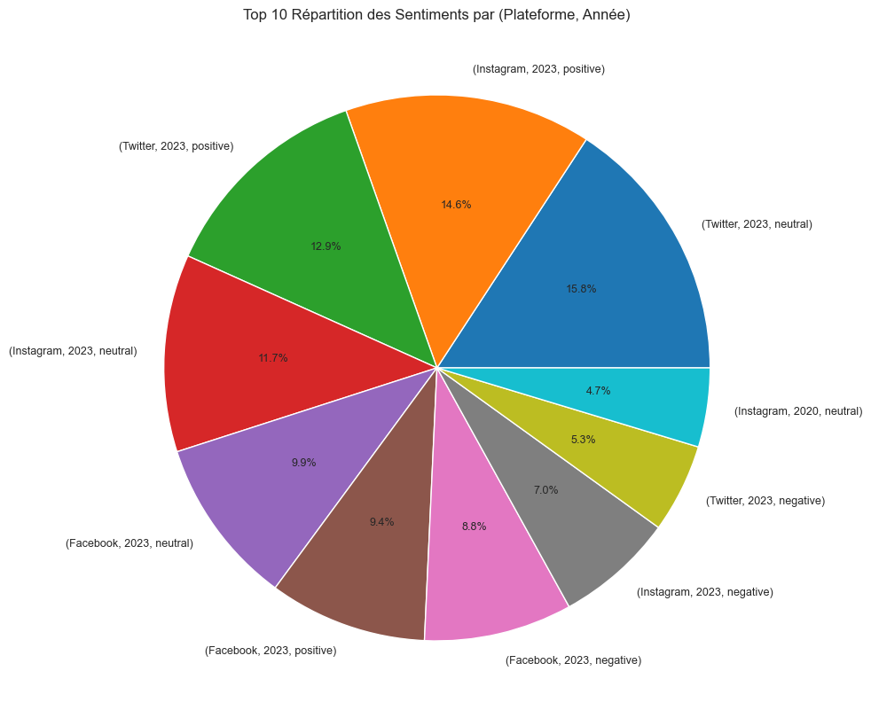
    


## ==============================================================================
# Phase 4 : Prétraitement du texte (inspiré des deux codes)
## ==============================================================================


```python
print("Exemple de texte original :\n", df['text'].iloc[2]) 

nltk.download('stopwords') # Assurer que les stopwords sont téléchargés
stop_words = set(stopwords.words('english'))
print(f"\nNombre de stopwords anglais : {len(stop_words)}")
print("Exemples de stopwords :", list(stop_words)[:10])

```

    Exemple de texte original :
     Don't angry me
    
    Nombre de stopwords anglais : 198
    Exemples de stopwords : ['couldn', 'hasn', 'your', 'm', 'of', 'nor', 'did', "couldn't", 'having', 'other']
    

    [nltk_data] Downloading package stopwords to
    [nltk_data]     C:\Users\donfa\AppData\Roaming\nltk_data...
    [nltk_data]   Package stopwords is already up-to-date!
    


```python
# Initialiser le Stemmer 
ps = PorterStemmer()
# Alternative : Lemmatizer (souvent préférable car donne des mots réels)
# from nltk.stem import WordNetLemmatizer
# lemmatizer = WordNetLemmatizer()

# Fonction de nettoyage et de stemming 
def preprocess_text(text):
    # S'assurer que l'entrée est une chaîne de caractères
    text = str(text)
    # 1. Mettre en minuscule
    text = text.lower()
    # 2. Supprimer les caractères non alphabétiques (garde les espaces)
    text = re.sub(r'[^a-z\s]', '', text)
    # 3. Tokenization (séparer en mots)
    tokens = word_tokenize(text)
    # 4. Supprimer les stopwords et appliquer le stemming (ou lemmatization)
    # stemmed_tokens = [ps.stem(word) for word in tokens if word not in stop_words and len(word) > 1] # len>1 pour éviter les lettres seules
    # Alternative avec Lemmatization:
    # lemmatized_tokens = [lemmatizer.lemmatize(word) for word in tokens if word not in stop_words and len(word) > 1]
    # On garde le stemming ici pour suivre le code 2
    processed_tokens = [ps.stem(word) for word in tokens if word not in stop_words and len(word) > 1]
    # 5. Rejoindre les tokens en une seule chaîne
    return " ".join(processed_tokens)

# Appliquer la fonction de prétraitement à la colonne 'text'
# Créons une nouvelle colonne pour comparer
df['cleaned_text'] = df['text'].apply(preprocess_text)

# Afficher le même exemple après nettoyage
print("\nMême exemple après nettoyage et stemming :\n", df['cleaned_text'].iloc[2]) 

# Comparer les 5 premiers textes originaux et nettoyés
print("\nComparaison avant/après nettoyage :")
display(df[['text', 'cleaned_text']].head())

```

    
    Même exemple après nettoyage et stemming :
     dont angri
    
    Comparaison avant/après nettoyage :
    


<div>
<style scoped>
    .dataframe tbody tr th:only-of-type {
        vertical-align: middle;
    }

    .dataframe tbody tr th {
        vertical-align: top;
    }

    .dataframe thead th {
        text-align: right;
    }
</style>
<table border="1" class="dataframe">
  <thead>
    <tr style="text-align: right;">
      <th></th>
      <th>text</th>
      <th>cleaned_text</th>
    </tr>
  </thead>
  <tbody>
    <tr>
      <th>0</th>
      <td>What a great day!!! Looks like dream.</td>
      <td>great day look like dream</td>
    </tr>
    <tr>
      <th>1</th>
      <td>I feel sorry, I miss you here in the sea beach</td>
      <td>feel sorri miss sea beach</td>
    </tr>
    <tr>
      <th>2</th>
      <td>Don't angry me</td>
      <td>dont angri</td>
    </tr>
    <tr>
      <th>3</th>
      <td>We attend in the class just for listening teachers reading on slide. Just Nonsence</td>
      <td>attend class listen teacher read slide nonsenc</td>
    </tr>
    <tr>
      <th>4</th>
      <td>Those who want to go, let them go</td>
      <td>want go let go</td>
    </tr>
  </tbody>
</table>
</div>


```python

# Recalculer le nombre de mots après nettoyage 
df['cleaned_word_count'] = df['cleaned_text'].apply(lambda x: len(x.split()))
print("\nStatistiques sur le nombre de mots après nettoyage :")
print(df['cleaned_word_count'].describe())

plt.figure(figsize=(12, 6))
sns.histplot(df['cleaned_word_count'], bins=40, kde=True)
plt.title('Distribution du Nombre de Mots par Tweet (Après Nettoyage)')
plt.xlabel('Nombre de mots nettoyés')
plt.show()

```

    
    Statistiques sur le nombre de mots après nettoyage :
    count    394.000000
    mean       6.385787
    std        3.649867
    min        0.000000
    25%        3.250000
    50%        6.000000
    75%        9.000000
    max       17.000000
    Name: cleaned_word_count, dtype: float64
    


    

    


#### On voit que la plupart des tweets nettoyés contiennent entre 2 et 10 mots, avec une moyenne d'environ 6 mots. Cela est cohérent avec la nature des tweets, qui sont souvent concis. Le nettoyage a réduit le nombre de mots dans les tweets, ce qui est attendu , environ la moitie


```python

# Re-générer un nuage de mots sur le texte nettoyé pour voir la différence
def generate_cleaned_wordcloud(sentiment_type, color, background_color):
    """Génère un nuage de mots à partir du texte nettoyé."""
    text_list = df[df["sentiment"] == sentiment_type]["cleaned_text"].astype(str).tolist()
    if not text_list: return
    full_text = ' '.join(text_list)
    if not full_text.strip(): # Vérifier si le texte n'est pas vide après nettoyage
         print(f"Le texte nettoyé pour '{sentiment_type}' est vide ou ne contient que des espaces.")
         return
    wordcloud = WordCloud(max_font_size=100, max_words=100, background_color=background_color,
                          colormap=color, width=800, height=600).generate(full_text)
    plt.figure(figsize=(10, 8))
    plt.imshow(wordcloud, interpolation="bilinear")
    plt.axis("off")
    plt.title(f'Nuage de mots pour "{sentiment_type}" (Texte Nettoyé)', fontsize=16)
    plt.show()

print("\nNuages de mots sur texte nettoyé :")
generate_cleaned_wordcloud("positive", "viridis", "white")
generate_cleaned_wordcloud("negative", "plasma", "black")
generate_cleaned_wordcloud("neutral", "Blues", "white")

```

    
    Nuages de mots sur texte nettoyé :
    


    
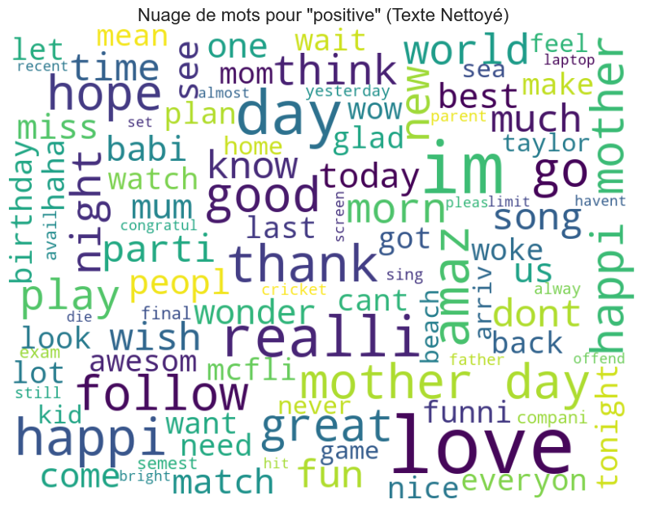
    


    
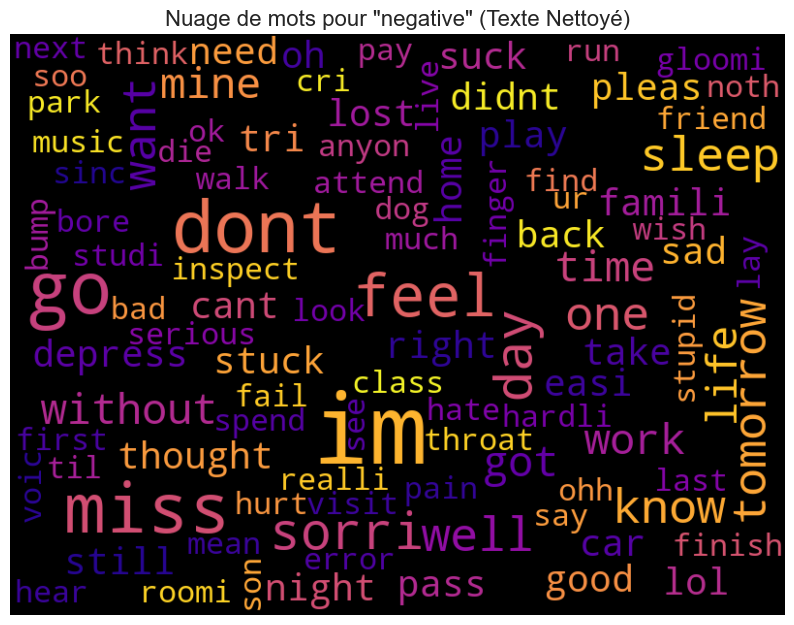
    


    
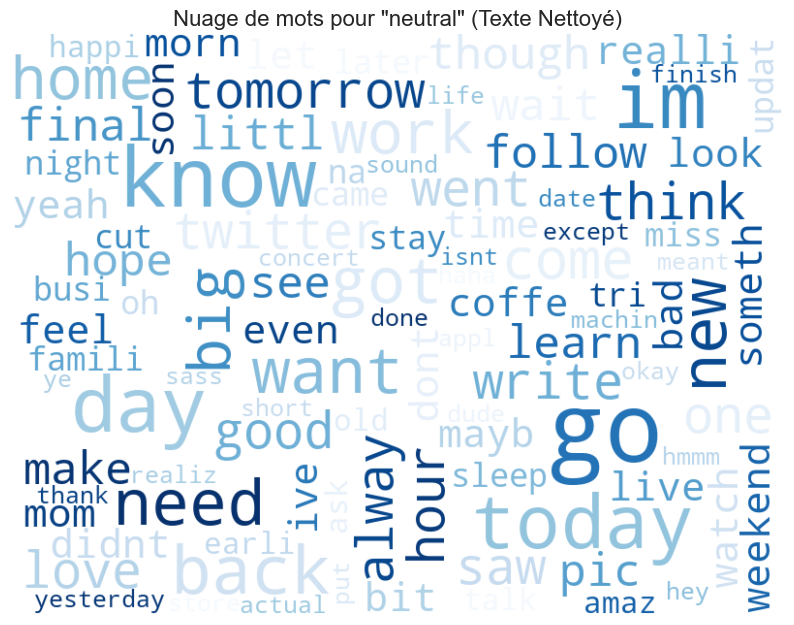
    


```python

# Analyse de la fréquence des mots après nettoyage (plus précis que word cloud)
# Utilisation de CountVectorizer  pour compter les mots (unigrammes)
from sklearn.feature_extraction.text import CountVectorizer

# On peut analyser tous les textes nettoyés ensemble
vectorizer_all = CountVectorizer()
all_text_counts = vectorizer_all.fit_transform(df['cleaned_text'])
word_freq_all = pd.DataFrame(all_text_counts.sum(axis=0), columns=vectorizer_all.get_feature_names_out()).T
word_freq_all.columns = ['frequency']
word_freq_all = word_freq_all.sort_values(by='frequency', ascending=False)

print("\nTop 30 mots les plus fréquents (après nettoyage) dans tout le dataset :")
display(word_freq_all.head(30))

```

    
    Top 30 mots les plus fréquents (après nettoyage) dans tout le dataset :
    


<div>
<style scoped>
    .dataframe tbody tr th:only-of-type {
        vertical-align: middle;
    }

    .dataframe tbody tr th {
        vertical-align: top;
    }

    .dataframe thead th {
        text-align: right;
    }
</style>
<table border="1" class="dataframe">
  <thead>
    <tr style="text-align: right;">
      <th></th>
      <th>frequency</th>
    </tr>
  </thead>
  <tbody>
    <tr>
      <th>im</th>
      <td>57</td>
    </tr>
    <tr>
      <th>go</th>
      <td>40</td>
    </tr>
    <tr>
      <th>day</th>
      <td>39</td>
    </tr>
    <tr>
      <th>love</th>
      <td>28</td>
    </tr>
    <tr>
      <th>know</th>
      <td>24</td>
    </tr>
    <tr>
      <th>like</th>
      <td>22</td>
    </tr>
    <tr>
      <th>dont</th>
      <td>20</td>
    </tr>
    <tr>
      <th>get</th>
      <td>18</td>
    </tr>
    <tr>
      <th>happi</th>
      <td>18</td>
    </tr>
    <tr>
      <th>miss</th>
      <td>17</td>
    </tr>
    <tr>
      <th>want</th>
      <td>16</td>
    </tr>
    <tr>
      <th>realli</th>
      <td>16</td>
    </tr>
    <tr>
      <th>today</th>
      <td>16</td>
    </tr>
    <tr>
      <th>good</th>
      <td>16</td>
    </tr>
    <tr>
      <th>back</th>
      <td>15</td>
    </tr>
    <tr>
      <th>got</th>
      <td>15</td>
    </tr>
    <tr>
      <th>one</th>
      <td>14</td>
    </tr>
    <tr>
      <th>need</th>
      <td>14</td>
    </tr>
    <tr>
      <th>that</th>
      <td>14</td>
    </tr>
    <tr>
      <th>feel</th>
      <td>13</td>
    </tr>
    <tr>
      <th>new</th>
      <td>13</td>
    </tr>
    <tr>
      <th>think</th>
      <td>13</td>
    </tr>
    <tr>
      <th>work</th>
      <td>13</td>
    </tr>
    <tr>
      <th>tomorrow</th>
      <td>12</td>
    </tr>
    <tr>
      <th>time</th>
      <td>12</td>
    </tr>
    <tr>
      <th>home</th>
      <td>12</td>
    </tr>
    <tr>
      <th>hope</th>
      <td>12</td>
    </tr>
    <tr>
      <th>follow</th>
      <td>12</td>
    </tr>
    <tr>
      <th>come</th>
      <td>11</td>
    </tr>
    <tr>
      <th>mother</th>
      <td>11</td>
    </tr>
  </tbody>
</table>
</div>


#### im, go day, love ,know sont les plus frequents


```python

# On peut aussi le faire par sentiment
def get_top_n_words(corpus, n=20):
    vec = CountVectorizer().fit(corpus)
    bag_of_words = vec.transform(corpus)
    sum_words = bag_of_words.sum(axis=0)
    words_freq = [(word, sum_words[0, idx]) for word, idx in vec.vocabulary_.items()]
    words_freq = sorted(words_freq, key = lambda x: x[1], reverse=True)
    return words_freq[:n]

print("\nTop 20 mots pour les sentiments POSITIFS (après nettoyage):")
positive_words = get_top_n_words(df[df['sentiment'] == 'positive']['cleaned_text'])
print(positive_words)

print("\nTop 20 mots pour les sentiments NEGATIFS (après nettoyage):")
negative_words = get_top_n_words(df[df['sentiment'] == 'negative']['cleaned_text'])
print(negative_words)

print("\nTop 20 mots pour les sentiments NEUTRES (après nettoyage):")
neutral_words = get_top_n_words(df[df['sentiment'] == 'neutral']['cleaned_text'])
print(neutral_words)

```

    
    Top 20 mots pour les sentiments POSITIFS (après nettoyage):
    [('love', 23), ('day', 21), ('im', 19), ('happi', 16), ('realli', 11), ('mother', 11), ('like', 9), ('amaz', 9), ('thank', 9), ('good', 8), ('go', 8), ('follow', 8), ('hope', 8), ('great', 7), ('play', 6), ('new', 6), ('world', 6), ('that', 6), ('think', 6), ('morn', 6)]
    
    Top 20 mots pour les sentiments NEGATIFS (après nettoyage):
    [('im', 25), ('dont', 12), ('go', 12), ('miss', 11), ('feel', 8), ('like', 8), ('sorri', 6), ('day', 6), ('want', 5), ('well', 5), ('sleep', 5), ('know', 5), ('tomorrow', 5), ('one', 5), ('got', 4), ('mine', 4), ('work', 4), ('life', 4), ('that', 4), ('without', 4)]
    
    Top 20 mots pour les sentiments NEUTRES (après nettoyage):
    [('go', 20), ('know', 14), ('im', 13), ('day', 12), ('today', 11), ('get', 11), ('back', 9), ('need', 8), ('got', 8), ('want', 8), ('big', 7), ('work', 7), ('home', 7), ('come', 6), ('love', 5), ('like', 5), ('alway', 5), ('went', 5), ('tomorrow', 5), ('new', 5)]
    

#### On voit que les mots les plus fréquents sont souvent des verbes ou des adjectifs, ce qui est logique dans le contexte des tweets. Les mots comme "love", "happy", "good" sont typiques des sentiments positifs, tandis que "hate", "bad", "sad" sont typiques des sentiments négatifs.


```python
def get_top_n_bigrams(corpus, n=20):
    # Utilise CountVectorizer avec ngram_range=(2, 2) pour les bigrammes
    vec = CountVectorizer(ngram_range=(2, 2)).fit(corpus)
    bag_of_words = vec.transform(corpus)
    sum_words = bag_of_words.sum(axis=0)
    words_freq = [(word, sum_words[0, idx]) for word, idx in vec.vocabulary_.items()]
    words_freq = sorted(words_freq, key = lambda x: x[1], reverse=True)
    return words_freq[:n]

print("\nTop 20 BIGRAMMES pour les sentiments POSITIFS (après nettoyage):")
positive_bigrams = get_top_n_bigrams(df[df['sentiment'] == 'positive']['cleaned_text'])
print(positive_bigrams)

print("\nTop 20 BIGRAMMES pour les sentiments NEGATIFS (après nettoyage):")
negative_bigrams = get_top_n_bigrams(df[df['sentiment'] == 'negative']['cleaned_text'])
print(negative_bigrams)

print("\nTop 20 BIGRAMMES pour les sentiments NEUTRES (après nettoyage):")
neutral_bigrams = get_top_n_bigrams(df[df['sentiment'] == 'neutral']['cleaned_text'])
print(neutral_bigrams)
```

    
    Top 20 BIGRAMMES pour les sentiments POSITIFS (après nettoyage):
    [('mother day', 8), ('happi mother', 7), ('realli great', 3), ('happi birthday', 3), ('great day', 2), ('look like', 2), ('sea beach', 2), ('semest final', 2), ('final exam', 2), ('day mom', 2), ('im think', 2), ('think im', 2), ('im go', 2), ('go fun', 2), ('follow us', 2), ('us recent', 2), ('recent pleas', 2), ('pleas dont', 2), ('dont offend', 2), ('offend havent', 2)]
    
    Top 20 BIGRAMMES pour les sentiments NEGATIFS (après nettoyage):
    [('want go', 4), ('lost voic', 2), ('im sorri', 2), ('feel gloomi', 2), ('fail inspect', 2), ('look like', 2), ('sorri hear', 2), ('go well', 2), ('im sad', 2), ('feel like', 2), ('dont know', 2), ('dont angri', 1), ('attend class', 1), ('class listen', 1), ('listen teacher', 1), ('teacher read', 1), ('read slide', 1), ('slide nonsenc', 1), ('go let', 1), ('let go', 1)]
    
    Top 20 BIGRAMMES pour les sentiments NEUTRES (après nettoyage):
    [('saw amaz', 2), ('come back', 2), ('today go', 2), ('machin learn', 2), ('except short', 2), ('short dude', 2), ('ye work', 2), ('hmmm mayb', 2), ('mayb that', 2), ('that meant', 2), ('alway want', 2), ('want go', 2), ('okay im', 2), ('im go', 2), ('let know', 2), ('got home', 2), ('home work', 2), ('good news', 2), ('news final', 2), ('final finish', 2)]
    
